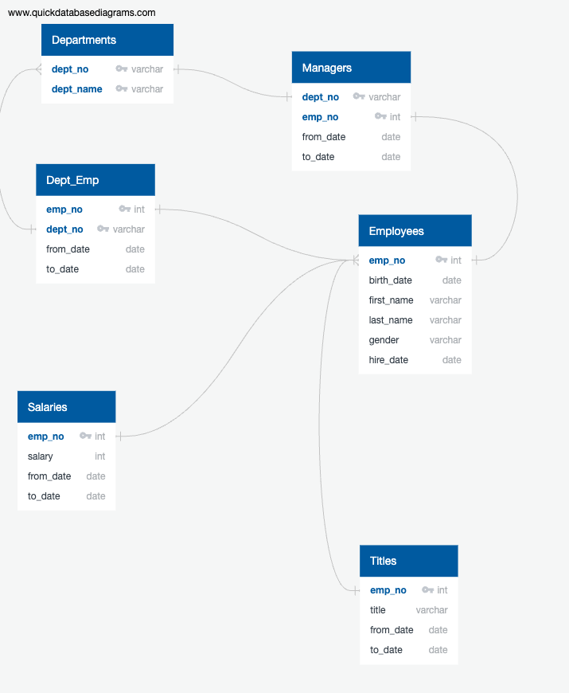

## Project Overview

Pewlett Hackard, a large company with many years in business, is facing a big challenge: a “silver tsunami." Several thousands of its employees are reaching their retirement age, and there will be several job openings. The company needs to anticipate and prepare for these upcoming changes. They need to find a solution to fill the new vacancies and train their  current employees so that they transition to new roles within the company.  


### Objectives

- Pewlett Hackard wants to know who meets the criteria to get a retirement package. 
- They also want to know which positions will need to be filled.

Despite being a large company, Pewlett Hackard has been mainly working with CSV files, VBA and Excel to manage their data. My role is to help an HR analyst upgrade their data management by building an employee database with SQL and by performing an analysis of the data.

## Analysis
To better understand the data, I examined the existing six CSV files: departments.csv, dept_emp.csv, dept_manager.csv, employees.csv, salaries.csv, and titles.csv. To create a database, we need to identify the common fields among these files and its potential to be used as primary and foreign keys to use them as links among the new SQL tables. 

A visual representation of the data facilitates the creation of the database; therefore, I created an Entity Relationship Diagram (ERD) to highlight the relationships between tables. I used [Quick Database Diagrams](https://www.quickdatabasediagrams.com/) to create the following diagram.




Modeling the data is a critical step in database creation because it provides a [framework]( https://www.sap.com/insights/what-is-data-modeling.html)  and at the same time shows how the data flows and why the database exists.   

To build the new database for Pewlett Hackard I used PostgreSQL, which is an open-source database management system. Using the framework I designed, I created the first table with the following code and imported the departements.csv file.


```
-- Creating tables for PH-EmployeeDB
CREATE TABLE departments(
	dept_no VARCHAR(4) NOT NULL,
	dept_name VARCHAR(40) NOT NULL,
	PRIMARY KEY (dept_no),
	UNIQUE(dept_name)
);
```

Using SQL queries, I created a database table for every CSV file defining relationships and constraints. after creating the tables I imported the data from the CSV files into their corresponding tables by using the Import/Export tool in PgAdmin. Once I had all the tables and data, I started with analysis. 

## Results:

It was established that employees born between 1952 and 1955 were going to be retiring soon. The first query created gave me a list of employees with birth dates between ‘1952’ and ‘1955.’ However, in order to determine retirement eligibility, it was necessary to narrow down the search and include only those employees hired between ‘1985’ and ‘1988.’ I used the following query to get that result. 

```
-- Retirement eligibility
SELECT first_name, last_name 
FROM employees
WHERE (birth_date BETWEEN '1952-01-01' AND '1955-12-31') 
AND (hire_date BETWEEN '1985-01-01' AND '1988-12-31');
```

I saved this information into a new table: “retirement_info” and exported it into a CSV file. The result of this query gave us a long list of employees, so I used the COUNT function to get only the number of employees that were about to retire.


The count was 42,380 employees. This preliminary result shows that Pewlett Hackard needs to start planning  ahead to fill the new vacancies. One solution would be to implement a Mentorship Program for their existing employees. However, they are requesting more information to have better insights into who is retiring and from what departments.  They requested the following lists of information:  

**Employee Information:** A list of employees containing their unique employee number, last name, first name, gender, and salary.

**Management:** A list of managers for each department, including the department number, name, and the manager's employee number, last name, first name, and the starting and ending employment dates. 

**Department Retirees:**  An updated current_emp list that includes the employee's departments.
______

-	**Employee Information**

I created this list using 2 inner joins and combined 3 tables: employees, salaries and dept_emp. 

```
SELECT e.emp_no,
e.first_name,
e.last_name,
e.gender,
s.salary,
de.to_date
INTO emp_info
FROM employees as e
INNER JOIN salaries as s
ON (e.emp_no = s.emp_no)
INNER JOIN dept_emp as de
ON (e.emp_no = de.emp_no)
WHERE (birth_date BETWEEN '1952-01-01' AND '1955-12-31')
AND (hire_date BETWEEN '1985-01-01' AND '1988-12-31')
AND (de.to_date = '9999-01-01');
 
```
The following image shows the first 10 rows of the table created with the employee information. This output showed something interesting; it seems that there hadn’t been any salary raises in recent years. 


I decided to inspect the data closely and looked at some of the existing tables. In the salaries table, I found out that there might be some missing data. I noticed that employee no. 10004 had only one salary listed but had changed positions in recent years and there is no new salary listed for this person. I used another query to see if there were other discrepancies in the data. The following query showed that there are several null values for current positions in the salary column.
I used a left join to get a list of all employees and titles regardless of whether there's a match on the salaries table or not. I joined the tables on employee number and from date to know what information is missing in the salaries table based on the start dates in the titles. 

```
--Missing salaries
SELECT ti.emp_no, ti.title, ti.to_date, s.salary, s.from_date, s.to_date
FROM titles as ti
LEFT JOIN salaries as s 
ON (s.from_date = ti.from_date) AND (s.emp_no = ti.emp_no)
ORDER BY ti.emp_no;
```


The image above shows the first ten rows of the missing salaries table. There are indeed salaries missing for current positions in the company. So, it seems that they haven't updated the salaries.csv file, or we might be working with an older version.

- **Management:**

The second list was a combination of three tables: departments, current_emp, and dept_name.
```
--List of managers per department. 
SELECT dm.dept_no,
        d.dept_name,
        dm.emp_no,
        ce.last_name,
        ce.first_name,
        dm.from_date,
        dm.to_date
INTO manager_info
FROM managers as dm
INNER JOIN departments AS d
ON(dm.dept_no=d.dept_no)
INNER JOIN current_emp AS ce
ON(dm.emp_no=ce.emp_no);
```
This result raised another issue; there are nine departments in Pewlett Hackard but the query only shows five active managers.


I inspected the managers' table and noticed that all nine departments had active managers. For instance, department no. d001 has two entries, one employee was manager from 1985-01-01 to 1991-10-01, and another employee from 1991-10-01 to today. I used employee '110039', the current manager in department 'd001', as a test subject to perform a series of queries to find out what had happened. The first query showed that the employee's birth year was 1963, so I thought that we could have been using the wrong information to create this list. 
```
SELECT emp_no, first_name, last_name, birth_date, hire_date
FROM employees
WHERE (emp_no = 110039);
```


 We used the *retirment_info* table to create *current_emp* table, which we used to show the list of managers per department; however, the retirement  info table contains only employees born between '1952-01-01' and '1955-12-31', so even if these are current employees, they are not *all* the current employees in Pewlett Hackard. This suggests that not all managers will be retiring soon. Here's another query and table showing more information about employee '110039.'
```
-- Employee no. 110039 Marketing Manager
SELECT DISTINCT e.emp_no, e.first_name, e.last_name, e.birth_date, e.hire_date, ti.title, ti.to_date, de.dept_no, d.dept_name
FROM employees AS e
INNER JOIN titles AS ti
ON ti.emp_no = e.emp_no
INNER JOIN dept_emp AS de
ON e.emp_no= de.emp_no
INNER JOIN departments AS d
ON d.dept_no = de.dept_no
WHERE (e.emp_no = 110039) 
AND (ti.to_date= '9999-01-01');
```


- **Department Retirees:** 

For the *Department Retirees list*, I also used two inner joins. The following table shows a list of current employees who are about to retire and their respective departments. One question that this list raises, is the fact that some employees are appearing twice. But after inspecting all three tables we can see that the employees appearing twice have held different positions in different departments during their time in the company.


## Challenge

To prepare for the "silver tsunami," Pewlett Hackard is requesting some additional research. They would like to determine the titles and the total number of retiring employees and assess their suitability to participate in the mentorship program.  Below, we can see the queries to find the total number of retiring employees per title and the respective count.

- **Number of retiring employees per title**

```
SELECT DISTINCT ON (e.emp_no)
e.emp_no, e.first_name, e.last_name, ti.title, ti.from_date, ti.to_date
INTO unique_titles
FROM employees AS e
INNER JOIN titles AS ti
ON (e.emp_no = ti.emp_no)
WHERE (e.birth_date BETWEEN '1952-01-01' AND '1955-12-31') 
AND (ti.to_date = '9999-01-01')
ORDER BY e.emp_no, ti.to_date DESC;
```


- **Retiring titles  Count**
```
SELECT COUNT (u.title), u.title
INTO retiring_titles
FROM unique_titles as u
GROUP BY u.title
ORDER BY COUNT (u.title) DESC;
```


The last two tables show that there is a total of 72458 employees that will be retiring soon. We can see that there are many senior engineers and senior staff that are about to retire, so this could be a cause of concern for PH. 

- **Mentorship Eligibility** 

Pewlett Hackard wants to establish a mentorship program to address this. One proposal for this initiative is to find current employees born between January 1965 and December 1965. The following query gave us a list of 1549 employees that could be eligible for the mentorship program. However, this list has some limitations because we only know that these people were born in 1965, but we don't know if they have the necessary qualifications. 

```
SELECT DISTINCT ON (e.emp_no)
e.emp_no, e.first_name, e.last_name, e.birth_date, de.from_date, de.to_date, ti.title
INTO mentorship_eligibility
FROM employees AS e
INNER JOIN dept_emp AS de 
ON (de.emp_no = e.emp_no)
INNER JOIN titles AS ti 
ON (ti.emp_no = e.emp_no)
WHERE de.to_date = '9999-01-01' 
AND (e.birth_date BETWEEN '1965-01-01' AND '1965-12-31')
ORDER BY e.emp_no, ti.to_date DESC;
```


## Summary


- **Mentors Program**

After analyzing Pewlett Hackard's data and needs, I would propose an ongoing **Mentors Program** in which they could look for current employees (not retiring soon), who are born between '1956' and '1965,' and who were hired between 1985 and 1995. The idea of this program is to proactively look for other experienced employees who could be interested in mentoring their colleagues. This would increase the likelihood of success in transferring knowledge within the company.


This is the query that provides a list of said employees. 
```
-- Mentors program
SELECT DISTINCT ON (e.emp_no)
e.emp_no, e.first_name, e.last_name, e.birth_date, e.hire_date, d.dept_name, ti.title
FROM employees AS e
INNER JOIN dept_emp as de
ON e.emp_no = de.emp_no
INNER JOIN titles as ti
ON e.emp_no = ti.emp_no
INNER JOIN departments as d
ON d.dept_no = de.dept_no
WHERE (birth_date BETWEEN '1956-01-01' AND '1965-12-31') 
AND (hire_date BETWEEN '1985-01-01' AND '1995-12-31')
AND (ti.to_date= '9999-01-01');
```


Pewllet Hackard will need to fill 72,458 roles within the next few years as the "silver tsunami" begins. The previous list gave us a total of 155,493 employees who are not about to retire and who have plenty of experience within the company. This initiative could be a long-term solution for Pewlett Hackard.


In a previous table **retiring titles count** we observed that there were 25,916
Senior Engineers and 24,926 Senior Staff about to retire. I decided to make a count of employees per title using the **new mentors program** table to show how many senior employees will be staying with the company. 
The following query gives us a count of employees per title who will still be working in the company in the next few years. The table shows that there are 58,313 Senior Engineers and 55,549 Senior Staff who could transfer knowledge to younger employees and new hires. 
```
-- Mentors count per title
SELECT COUNT (DISTINCT e.emp_no), ti.title
FROM employees AS e
INNER JOIN dept_emp as de
ON e.emp_no = de.emp_no
INNER JOIN titles as ti
ON e.emp_no = ti.emp_no
INNER JOIN departments as d
ON d.dept_no = de.dept_no
WHERE (birth_date BETWEEN '1956-01-01' AND '1965-12-31') 
AND (hire_date BETWEEN '1985-01-01' AND '1995-12-31')
AND (ti.to_date= '9999-01-01')
GROUP BY ti.title
ORDER BY COUNT (DISTINCT e.emp_no);
```


We could also look at the following table to see the breakdown per department.


In conclusion, migrating from CSV files to SQL database allowed PH to create queries that would've been more challenging to perform with just the CSV files. Also, creating an SQL database presents other advantages such as improved data integrity, and the possibility to be expanded to address future requirements.


